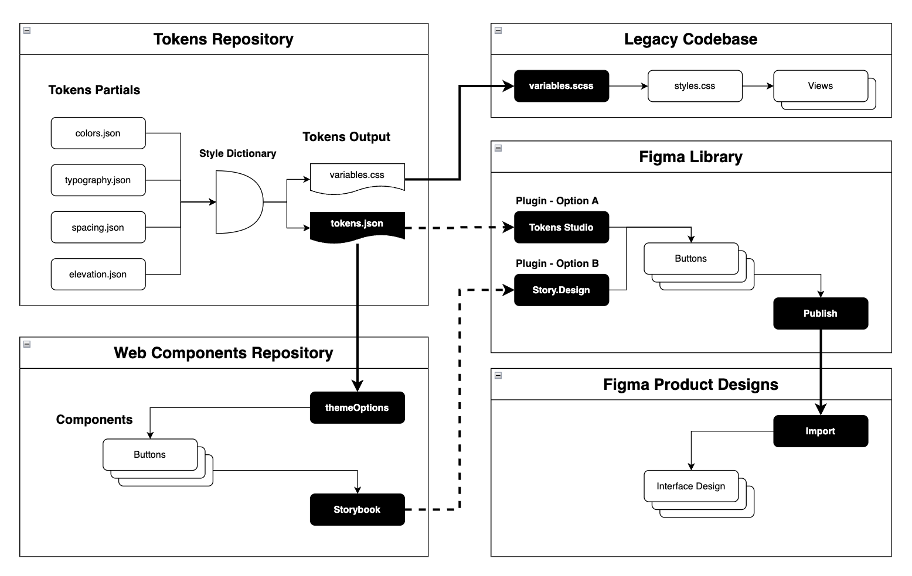

# Managing multi-brand Design Tokens System for SaaS applications

This repository contains our design tokens system that supports multiple brands and platforms across
a single SaaS application. This system allows us to maintain consistent branding while accommodating
platform-specific requirements.



The image is a design token architecture diagram that showcases how design tokens flow through various repositories, tools, and platforms. 

The branded generated tokens are passed on to the Mantine UI library to be used in the application.

The [mantine-vars.md](mantine-vars.md) file contains the variables that need to be mapped to the Mantine UI library.

## System Overview

The system demonstrates three common approaches to theming:
1. Default theme (`_default`): Provides a complete set of baseline tokens that other themes can extend or override, ensuring no missing values
2. Single brand theme (`cco`): Shows how to customize tokens for a specific brand while inheriting sensible defaults
3. Multi-brand system using Blooming Brands International (`bbi_*`) as an example: Illustrates how to manage a family of related brands with shared elements and brand-specific customizations

- Multiple brands
  - Default (`_default`)
  - ClearCompany (`cco`)
  - BloominBrands International (`bbi_default`)
    - Bonefish Grill (`bbi-bonefish`)
    - Carraba's Italian Grill (`bbi-carrabas`)
    - Fleming's Prime Steakhouse & Wine Bar (`bbi-flemings`)
    - Outback Steakhouse (`bbi-outback`)
- Multiple platforms (Web, iOS, Android)
- Shared global tokens across all products

## Project Structure

```
tokens/
├── brands/          # Brand-specific tokens (colors, logos, etc.)
│   ├── _default/   # Default brand tokens
│   ├── cco/        # ClearCompany tokens
│   └── bbi_default/ # BloominBrands tokens
├── platforms/       # Platform-specific tokens (fonts, etc.)
├── components/      # Component-specific tokens
└── globals/        # Shared tokens across all brands/platforms
    └── color/      # Global color palettes
```

## Prerequisites

- Node.js (v14 or higher)
- npm (v6 or higher)

## Getting Started

1. Install dependencies:

```bash
npm install
```

2. Build tokens:

```bash
npm run build
```

The build process will generate platform-specific files in the `build/` directory, organized by
brand.

## How It Works

The build system uses Style Dictionary to generate tokens for each brand/platform combination. Key
features:

- Global color palette that defines base colors
- Brand-specific values that reference the palette
- Platform-specific values (e.g., system fonts)
- Global shared values (e.g., spacing, typography scale)
- Component-specific tokens for consistent UI elements

The color system follows a two-level structure:
1. Global palette (`tokens/globals/color/palette.json`) defines all possible colors
2. Brand-specific files (`tokens/brands/[brand]/color.json`) reference these palette colors to create their brand tokens

This approach ensures color consistency while allowing brand-specific customization.

## Token Structure

### Color Palette

The global color palette (`tokens/globals/color/palette.json`) defines our base colors that can be referenced by all brands:

```json
{
  "color": {
    "palette": {
      "neutral": {
        "white": { "value": "#FFFFFF" },
        "black": { "value": "#000000" },
        "gray": {
          "100": { "value": "#F5F5F5" },
          "200": { "value": "#EEEEEE" },
          "300": { "value": "#E0E0E0" },
          // ... other gray values
          "900": { "value": "#212121" }
        }
      },
      "blue": {
        "100": { "value": "#E3F2FD" },
        "500": { "value": "#2196F3" },
        "900": { "value": "#0D47A1" }
      }
      // ... other color scales
    }
  }
}
```

These base palette colors are then referenced by brand-specific tokens:

### Brand Colors:

```json
{
  "color": {
    "brand": {
      "primary": { "value": "#0066CC" },
      "secondary": { "value": "#FF4D4D" }
    }
  }
}
```

### Platform-Specific Fonts:

```json
{
  "font": {
    "family": {
      "base": { "value": "{font.platform.system.value}" }
    }
  }
}
```

### Component Tokens:

```json
{
  "button": {
    "primary": {
      "background": { "value": "{color.brand.primary.value}" },
      "text": { "value": "{color.neutral.white.value}" }
    }
  }
}
```

## Build Output

The system generates appropriate format files for each platform:

- Web: 
  - SCSS variables
  - JSON Tokens following the [Design Tokens Community Group](https://design-tokens.github.io/community-group/format/) format
- iOS: Swift constants
- Android: XML resources

Output locations:
```
build/
├── web/            # Web platform outputs
│   ├── _default/   # Default brand
│   ├── cco/        # ClearCompany brand
│   └── ...         # Other brands
├── ios/            # iOS platform outputs
└── android/        # Android platform outputs
```

## Contributing

### Adding a New Brand

1. Create a new folder in `tokens/brands/[brand-name]`
2. Add brand-specific token files (colors.json, etc.)
3. Update `build.js` to include the new brand name
4. Test the build process with the new brand

### Adding a New Platform

1. Create a new folder in `tokens/platforms/[platform-name]`
2. Add platform-specific configurations in `build.js`
3. Define appropriate Style Dictionary formats and transforms
4. Add platform-specific documentation

